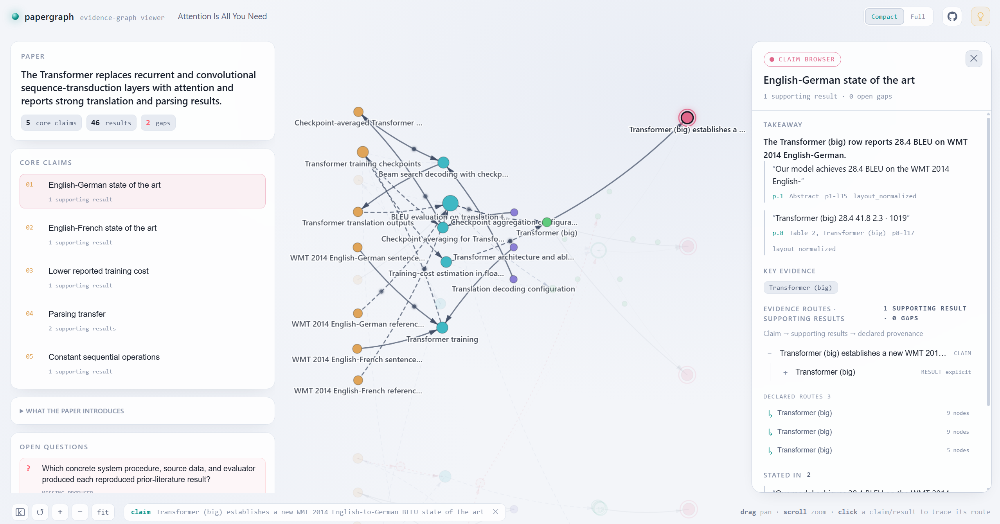

<div align="center">

# PaperGraph

<strong>提取、校验并探索论文证据图谱。</strong>

<p>
  <a href="README.md">English</a>
  &nbsp;|&nbsp;
  <a href="README.zh-CN.md">简体中文</a>
</p>

<p>
  <a href="https://github.com/ZakuZakuu/papergraph/releases/latest"></a>
  <a href="https://pypi.org/project/papergraph/"></a>
  <a href="https://github.com/ZakuZakuu/papergraph/actions/workflows/ci.yml"></a>
  <a href="LICENSE"></a>
  
  
</p>

</div>

papergraph 将面向 Agent 的抽取 skill、轻量 CLI 和静态交互式查看器组合在一起。它把论文转化为由 artifact、procedure、configuration、result、claim 及其可追溯关系构成的结构化图谱。



## 先看效果

- **在线演示：** [Attention Is All You Need](https://zakuzakuu.github.io/papergraph/demo/attention-is-all-you-need/)，附有[来源与研究用途说明](docs/demo/attention-is-all-you-need/NOTICE.md)。
- **查看器解决什么问题：** 从核心 Claim 开始，沿着证据路径查看支撑它的 Result；需要时打开具体节点；对于缺失证据或未充分支持的 Claim，明确展示 Gap，而不是把它们藏起来。

在线演示包含的是已注明来源论文的选择性引文与图谱数据，不包含原 PDF 或论文插图。复用前请阅读该演示的说明。其他真实论文可在本地研究流程中使用，但其抽取出的引文与图谱产物不会被默认提交到本仓库。

## 交给 Agent 使用

把下面提示词交给 Agent，再提供论文路径、URL 或附件即可。skill 会处理 CLI 配置、校验和查看器生成；在下载或安装任何内容前，它会向用户说明并征得确认。

```text
Read the PaperGraph extraction skill at:
https://github.com/ZakuZakuu/papergraph/tree/main/skills/extract-paper-evidence-graph

Read SKILL.md and every file it requires in references/. Follow the skill to
extract and visualize an evidence graph for the paper provided below.

<PASTE A PDF PATH, PAPER URL, OR ATTACH THE PAPER HERE>
```

生成的查看器是纯静态文件，不需要启动服务。

## PaperGraph 的组成

| 层级 | 职责 |
| --- | --- |
| **抽取 skill** | 指导 Agent 完成覆盖计划、基于引文的抽取、自检，以及最终 CLI 校验门槛。 |
| **PaperGraph CLI** | 校验 JSON 契约并组装可移植的查看器。它没有运行时依赖，也可以通过带版本号的 `.pyz` bundle 运行。 |
| **静态查看器** | 在本地浏览器中打开生成的图谱，提供以 Claim 为起点的阅读、provenance route、Compact/Full Result 视图和可追溯检查。 |

仓库也遵循这套结构：`skills/` 存放抽取指令，`src/papergraph/` 存放 CLI 及内置查看器，`tests/` 保护契约和打包行为。

## 手动配置

如果你希望手动配置和运行工具，可以从 PyPI 安装：

```bash
pip install papergraph
```

也可以从 GitHub Release 下载无需安装的 `papergraph.pyz`：

```bash
python3 papergraph.pyz validate --graph graph.json --coverage coverage-plan.json --source paper.json
python3 papergraph.pyz build --graph graph.json --coverage coverage-plan.json --source paper.json --out ./viewer-out
```

安装后的命令行用法等价：

```bash
papergraph validate --graph graph.json --coverage coverage-plan.json --source paper.json
papergraph build --graph graph.json --coverage coverage-plan.json --source paper.json --out ./viewer-out
```

用任意现代浏览器直接打开 `viewer-out/index.standalone.html` 即可。它是一个自包含 HTML 文件，不需要服务器、CDN、字体下载或任何网络请求。

## 校验意味着什么

papergraph 校验的是**格式与溯源结构**，不是学术事实本身。它会检查图谱是否符合契约，以及引用的文本是否真实出现在声明的源 span 中；它不会判断某个 Claim 是否在科学上成立、现有证据是否充分，也不会判断抽取模型的解释是否合理。因此应把图谱当作可检查的研究辅助材料，而不是对论文作出的自动结论。

## 格式与兼容性

- 图谱格式：`paper-evidence-graph/0.2`
- 覆盖计划格式：`paper-evidence-coverage/0.1`
- Python：3.10+
- 运行时依赖：无，仅使用 Python 标准库

可执行 schema 位于 `src/papergraph/schemas/`。skill 中的 [`graph-contract.md`](skills/extract-paper-evidence-graph/references/graph-contract.md) 是面向人的对应说明。

## 开发

```bash
git clone https://github.com/ZakuZakuu/papergraph.git
cd papergraph
python3 -m pip install -e ".[dev]"
pytest
```

产品行为和长期决策见 [`docs/`](docs/README.md)。查看器的设计语言与来源说明见 [`ACKNOWLEDGEMENTS.md`](ACKNOWLEDGEMENTS.md)。合成测试 fixture 单独以 CC0-1.0 贡献，见 `tests/fixtures/synthetic/LICENSE`。

## 许可证

Apache-2.0，见 [LICENSE](LICENSE)。
